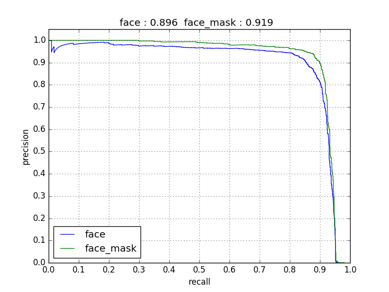

# FaceMaskDetection
[English Version](README.md) | 中文版
## [updates]
### 人脸口罩检测，现开源所有主流框架模型和推理代码，支持的框架如下：

 - [x] PyTorch
- [x] TensorFlow（包含tflite模型和pb模型）
- [x] Keras
- [x] MXNet
- [x] Caffe

**检测人脸并判断是否佩戴了口罩， 并开源近8000张人脸口罩标注数据**

Detect faces and determine whether they are  wearing mask.

**首先，祝愿我国和世界各国早日战胜新冠肺炎疫情，武汉加油！中国加油！**

*  我们开源了人脸口罩检测的**所有主流框架（PyTorch、TensorFlow、Keras、MXNet和caffe）的相应模型**（使用keras训练的模型，并转换得到的其他框架模型），并提供了**所有五大框架**的的推理代码。所有模型都在`models`文件夹下。


* 开源了标注的7959张人脸标注图片，数据集来自于[WIDER Face](http://shuoyang1213.me/WIDERFACE/)和[MAFA](http://www.escience.cn/people/geshiming/mafa.html)数据集, 我们重新修改了标注并进行了校验(主要是
MAFA和WIDER Face的人脸位置定义不一样，所以我们进行了修改标注)并将其开源出来。（有需要的朋友，敬请关注我们新建的公众号AIZOO（本文末也有二维码，可以扫描关注），回复**口罩数据集**就可以了。公众号刚开，恳请大家帮忙关注和扩散一下～）


关于本项目的介绍，请参考以下三篇我们公众号的文章

* [AIZOO开源人脸口罩检测数据+模型+代码+在线网页体验，通通都开源了](https://mp.weixin.qq.com/s?__biz=MzIyMDY2MTUyNg==&mid=2247483755&idx=1&sn=102c178eeb359617c67aa8cc615a90ce&chksm=97c9d312a0be5a04935c63857e05b1b00a8b5c298d6fa0ffca35e8d026c09169c3ca62e620a2&mpshare=1&scene=1&srcid=&sharer_sharetime=1585995397229&sharer_shareid=cfe18de94f3a847e5ada278bbc490577&exportkey=AQVINroZXgLbi%2BgTqyA1uG8%3D&pass_ticket=mWIVA3QAV6s8RB5LXrZtstiHlu59hNAG7UDhJOnA43G9Pe8xmbQCr%2FksIbtTbVUi#rd)

* [人脸口罩检测现开源PyTorch、TensorFlow、MXNet等全部五大主流深度学习框架模型和代码](https://mp.weixin.qq.com/s?__biz=MzIyMDY2MTUyNg==&mid=2247483779&idx=1&sn=b9ac5af31adf1dfdc3c87eb1c74836a5&chksm=97c9d3faa0be5aec5d8d893646a77f1147cea4aeda0e8258584729bf9c59a15441f09ff7f100&mpshare=1&scene=1&srcid=&sharer_sharetime=1585995407790&sharer_shareid=cfe18de94f3a847e5ada278bbc490577&exportkey=AROJbMty%2FxxyFnWvnh0coOc%3D&pass_ticket=mWIVA3QAV6s8RB5LXrZtstiHlu59hNAG7UDhJOnA43G9Pe8xmbQCr%2FksIbtTbVUi#rd)

* [如何在浏览器运行深度神经网络？以人脸口罩识别为例进行讲解](https://mp.weixin.qq.com/s?__biz=MzIyMDY2MTUyNg==&mid=2247483795&idx=1&sn=05e5e3e7d895d8993592b3141e39446b&chksm=97c9d3eaa0be5afcb36b8ac124eb5e7d6d86f549f15b634db194eddc784e85f3d7d8abccc216&mpshare=1&scene=1&srcid=&sharer_sharetime=1585995559259&sharer_shareid=cfe18de94f3a847e5ada278bbc490577&exportkey=AYmJnEAPff9hYzZVMv21kss%3D&pass_ticket=mWIVA3QAV6s8RB5LXrZtstiHlu59hNAG7UDhJOnA43G9Pe8xmbQCr%2FksIbtTbVUi#rd)

我们也使用TensorFlow.js部署了一个网页版，大家可以点击下面链接访问
欢迎大家点击链接在线体验

[aizoo.com跑在您浏览器的口罩检测模型](https://demo.aizoo.com/face-mask-detection.html)
## 模型结构
我们在本项目中使用了SSD类型的架构，为了让模型可以实时的跑在浏览器以及终端设备上，**我们将模型设计的非常小，只有101.5万个参数**。模型结构在本文附录部分。

本模型输入大小为260x260，主干网络只有8个卷积层，加上定位和分类层，一共只有24层（每层的通道数目基本都是32\64\128），所以模型特别小，只有101.5万参数。模型对于普通人脸基本都能检测出来，但是对于小人脸，检测效果肯定不如大模型。具体效果，大家可以点击以下链接，访问我们的网站在线体验效果。
[aizoo.com跑在您浏览器的口罩检测模型](https://demo.aizoo.com/face-mask-detection.html)

网页使用了Tensorflow.js库，所以模型是完全运行在您浏览器里面的。运行速度的快慢，取决于您电脑配置的高低。

模型在五个卷积层上接出来了定位分类层，其大小和anchor设置信息如下表.


| 卷积层 | 特征图大小 | anchor大小 | anchor宽高比（aspect ratio）|
| ---- | ---- | ---- | ---- |
|第一层|33x33|0.04,0.056|1,0.62,0.42|
|第二层|17x17|0.08,0.11|1,0.62,0.42|
|第三层|9x9|0.16,0.22|1,0.62,0.42|
|第四层|5x5|0.32,0.45|1,0.62,0.42|
|第五层|3x3|0.64,0.72|1,0.62,0.42|

## 运行方法
### pytorch
如果您要运行图片：
```
python pytorch_infer.py  --img-path /path/to/your/img
```
如果您要在视频上跑，只需要：
```
python pytorch_infer.py --img-mode 0 --video-path /path/to/video  
# 如果要打开本地摄像头, video_path填写0就可以了，如下
python pytorch_infer.py --img-mode 0 --video-path 0
```
### TensorFlow/Keras/MXNet/Caffe
另外四大框架运行方法基本类似，只不过将`pytorch_infer.py`中`pytorch`的换成`对应框架名字即可即可`，以`TensorFlow`为例：
```
python tensorflow_infer.py  --img-path /path/to/your/img
```
**注意，对于caffe的推理，我们使用了permute层，所以需要使用caffe-ssd，也就是SSD作者开源的[caffe版本](https://github.com/weiliu89/caffe/tree/ssd)**，官方版本的caffe并不包含permute层。您也可以使用opencv的dnn模块来加载模型推理，opencv支持permute层。

不过如果您需要可以在官方版本的caffe上可以运行的模型，也可以联系我们修改模型，实现不需要permute层的模型。
## 附录
### 问题反馈与交流
欢迎AI圈和科技圈的朋友关注我们的公众号，这是我们分享AI技术和资讯的地方。我们要做的事情是搭建开发者和AI算法和产品需求方的一个桥梁，欢迎有AI算法需求的朋友关注我们，也欢迎有熟练算法和开发经验的工程师添加我们，与我们交流。


**如果你有任何问题，欢迎关注我们的公众号，通过后台给我留言，或者添加作者元峰的微信AIZOOTech与我联系 ，我会将您拉入AIZOO技术交流群。**
我们的技术交流群二维码，欢迎算法开发者和需求方进群交流，请输入备注，例如`张三丰-浙大-目标检测`或者`张三丰-腾讯-图像分割`

** 扫描元峰的微信号，邀请您入群。**


### 模型结构图
为了可视化方便，我们省略了BN层，如果您要查看完整模型，可以查看`img`文件夹的`face_mask_detection.hdf5.png`图片


### 测试集PR曲线

因为WIDER face是一个任务比较复杂的数据集，我们的模型又设计的非常小，所以对于人脸的PR曲线并不是那么性感。这点可以通过设计大模型来提升对于小人脸的检测效果，如果您有需求，欢迎通过上述二维码联系我们。


因为WIDER face是一个任务比较复杂的数据集，我们的模型又设计的非常小，所以对于人脸的PR曲线并不是那么性感。**这点可以通过设计大模型来提升对于小人脸的检测效果，如果您有需求，欢迎通过上述二维码联系我们。**


### 我们的网页长这样
欢迎大家点击链接在线体验

[aizoo.com跑在您浏览器的口罩检测模型](https://demo.aizoo.com/face-mask-detection.html)


